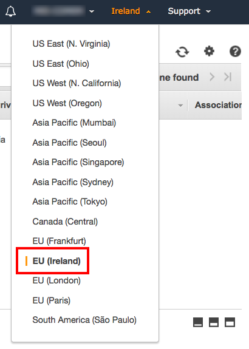
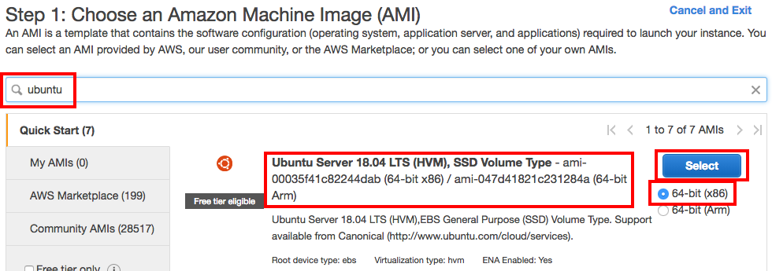
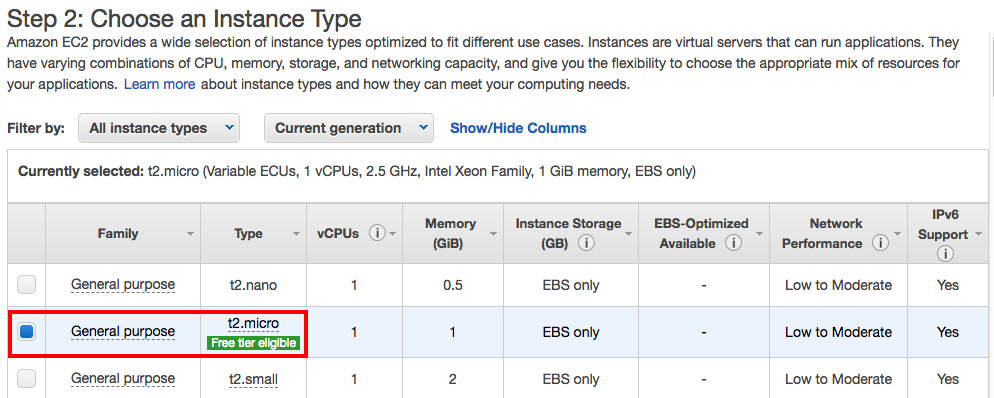
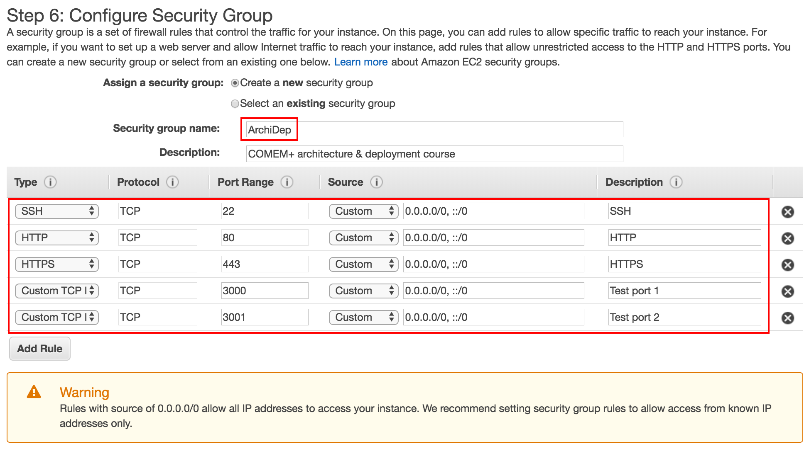
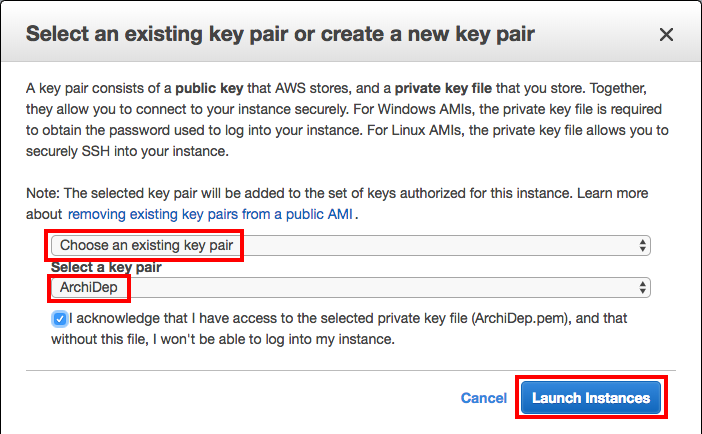
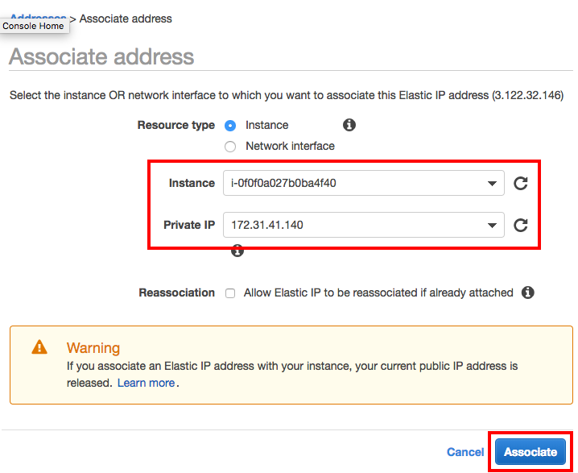

# COMEM+ Architecture & Deployment Exercises

<!-- START doctoc generated TOC please keep comment here to allow auto update -->
<!-- DON'T EDIT THIS SECTION, INSTEAD RE-RUN doctoc TO UPDATE -->


- [Version control](#version-control)
  - [Collaborative exercise (graded)](#collaborative-exercise-graded)
  - [Clone a repository from a server](#clone-a-repository-from-a-server)
  - [Push a repository to a server](#push-a-repository-to-a-server)
- [Unix](#unix)
  - [Permissions](#permissions)
  - [Pipelines](#pipelines)
- [Basic deployment](#basic-deployment)
  - [Run your own virtual server on Amazon Web Services (bonus)](#run-your-own-virtual-server-on-amazon-web-services-bonus)

<!-- END doctoc generated TOC please keep comment here to allow auto update -->


## Version control

### Collaborative exercise (graded)

Follow the instructions in the [exercise repository][php-todo-ex].

### Clone a repository from a server

The goal of this exercise is to demonstrate how to retrieve a project's source code with Git while connected to a remote server.

Perform the following tasks:

* Connect to the `archidep-2018.media` exercise server with SSH.
* Clone your team's solution repository from the collaborative exercise somewhere in your home directory.
  * If you have not completed the collaborative exercise, you can try doing the same with the [base repository][php-todo-ex].

### Push a repository to a server

The goal of this exercise is to demonstrate how to push a project's source code to a server with Git, from your local machine.

Perform the following tasks:

* Connect to the `archidep-2018.media` exercise server with SSH.
* Create a new empty repository in your home directory.
  * *Hint:* use the `mkdir`, `cd` and `git init` commands.
* Switch to another branch in the repository.

  (This is necessary because Git will not let you push to a branch that is checked out (it could overwrite files).
  Since we want to push the master branch to the server later, you must switch to another branch first.)
  * *Hint:* use the `git checkout -b` command.
* Disconnect from the exercise server.
* Move into your team's solution repository from the collaborative exercise.
  * If you have not completed the collaborative exercise, you can clone the [base repository][php-todo-ex] instead with the `git clone` command, and move into that.
* Add a new remote pointing to the repository you created on the exercise server.
  * *Hint:* the command to add a remote is `git remote add <name> <url>`
  * *Hint:* the URL syntax for an SSH remote is `ssh://user@host/path/to/repo`
* Push the `master` branch to the new remote.
  * *Hint:* the syntax of the push command is `git push [origin] [branch]`
* Connect to the `archidep-2018.media` exercise server with SSH.
* Move into the repository you created earlier.
* Checkout the `master` branch and make sure your code is there (e.g. with `ls`).


## Unix

### Permissions

* Create a `/home/YOURUSER/alice` directory.

  **Solution:**

  ```bash
  $> cd ~
  $> mkdir alice
  ```
* The `alice` user must be able to traverse, but not read this directory.

  **Solution with symbolic mode:**

  ```bash
  $> chmod o-x alice
  ```

  **Solution with octal mode:**

  ```bash
  $> chmod 751 alice
  ```
* The directory must contain a `readable.txt` file that `alice` can read from, but not write to.

  **Solution:**

  ```bash
  $> echo "some content" > readable.txt
  ```
* The directory must contain a `writable.txt` file that `alice` can read from and write to.

  **Solution with chmod with symbolic or octal mode:**

  ```bash
  $> echo "some other content" > writable.txt
  $> chmod o+w writable.txt
  $> chmod 666 writable.txt
  ```

  **Solution with chown:**

  ```bash
  $> echo "some other content" > writable.txt
  $> sudo chown alice writable.txt
  ```

### Pipelines

Download the exercice file to your computer with the following command:

```bash
$> curl -L https://git.io/fAjRa > rainbow.txt
```

Display the file:

```bash
$> cat rainbow.txt
Somewhere over the rainbow
...
```

Use command pipelines and stream redirections to:

* Count the number of lines and characters in the text.

  **Solution:**

  ```bash
  $> cat rainbow.txt | wc -l
  50
  $> cat rainbow.txt | wc -m
  1284
  ```

  **Solution counting the number of characters excluding new lines:**

  ```bash
  $> cat rainbow.txt | fold -w 1 | wc -l
  1242
  ```
* Print the lines of the text containing the word `rainbow`.

  **Solution:**

  ```bash
  $> cat rainbow.txt | grep rainbow
  Somewhere over the rainbow
  Somewhere over the rainbow
  Somewhere over the rainbow
  The colors of the rainbow so pretty in the sky
  Oh, somewhere over the rainbow
  ```

* Do the same but without any duplicates.

  **Solution:**

  ```bash
  $> cat rainbow.txt | grep rainbow | sort | uniq
  Oh, somewhere over the rainbow
  Somewhere over the rainbow
  The colors of the rainbow so pretty in the sky
  ```
* Print the second word of each line in the text.

  **Solution:**

  ```bash
  $> cat rainbow.txt | cut -d ' ' -f 2
  over
  up
  the
  in

  over
  fly
  ...
  ```
* Compress the text and save it to `rainbow.txt.gz`.

  **Solution:**

  ```bash
  $> cat rainbow.txt | gzip -c > rainbow.txt.gz
  ```
* Count the number of times the letter `e` or the word `the` is used.

  **Solution for the letter `e`:**

  ```bash
  $> cat rainbow.txt | fold -w 1 | grep e | wc -l
  131
  ```

  **Solution for the word `the`:**

  ```bash
  $> cat rainbow.txt | tr '[:upper:]' '[:lower:]' | tr -s '[[:punct:][:space:]]' '\n' | grep -w the | wc -l
  ```
* Display a list of the unique words in the text along with the number of times each word is used,
  sorted from the least used to the most used.

  **Solution:**

  ```bash
  cat rainbow.txt | tr '[:upper:]' '[:lower:]' | tr -s '[[:punct:][:space:]]' '\n' | sort | uniq -c | sort -bn
  ```


## Basic deployment

### Run your own virtual server on Amazon Web Services (bonus)

* Apply for [AWS Educate](https://aws.amazon.com/education/awseducate/apply/) if you are a student.
  * If you have a credit card, you can instead register a personal [AWS account](https://portal.aws.amazon.com/billing/signup#/start).

    You will be able to run a small free server that is sufficient for the needs of this course.
* Access the [EC2 Dashboard](https://eu-west-1.console.aws.amazon.com/ec2).
* Select the **EU Ireland region** at the top right of the screen in the menu bar.
  It is the cheapest european region.

  
* [Import your public key](https://eu-west-1.console.aws.amazon.com/ec2) under **Key Pairs** so that you don't have to create a new one.

  You can display your public key by running the following command in your terminal: `cat ~/.ssh/id_rsa.pub`.

  

  This will make it simpler for you to connect to your virtual server once it's launched.
* Go to [**Instances**](https://eu-west-1.console.aws.amazon.com/ec2) and **launch an instance**.
  * **Step 1:** Search and select the following Ubuntu AMI: `Ubuntu Server 18.04 LTS (HVM), SSD Volume Type`.
    Use the default 64-bit (x86) version.

    
  * **Step 2:** Select the `t2.micro` instance type.

    
  * **Step 3:** Leave the default instance details.
  * **Step 4:** Leave the default storage configuration.
  * **Step 5:** Add a `Name` tag to easily identify your instance.

    
  * **Step 6:** Create a security group with the following inbound ports open: 22, 80, 443, 3000 & 3001.

    

    The security warning indicates that it's good practice
    to limit the IP addresses authorized to access your virtual server.
    You may do so if you wish, but it's not necessary for this course.
  * **Step 7:** Launch the virtual server.

    

    Select the public key you imported or create a new one.
    If you create a new one, you will have to download it and use it to connect to the server.

    
* Go to **Elastic IPs** in the menu, and allocate a new IP address.
* Select the new IP address and associate it.

  

  Select the instance you just launched and its private IP address
  (*the identifiers will _not be the same_ as in this screenshot*):

  

  Your instance now has a fixed public IP address on the Internet.
* Connect to your new instance over SSH.

  By default, the selected instance type creates an `ubuntu` user.

  Assuming the instance's public IP address is `2.2.2.2` (replace with the elastic IP address you allocated):

  * If you imported your own public key, connect with `ssh ubuntu@2.2.2.2`.
  * Or, if you created and downloaded a new key pair when launching the instance, connect with `ssh -i path/to/key.pem ubuntu@2.2.2.2`.
* Once you are connected as `ubuntu`, run the following command to give the teacher access to your instance:

  ```bash
  $> echo "ssh-rsa AAAAB3NzaC1yc2EAAAADAQABAAAEAQC4kSxG07ffvlSRaQkiq3j14gSz9Fm8eCREGBBOJQ9O2BUj64qUw2m7hYIP+m0vdl81uBg0TAl1Hp0GO/g3SuVRbrbM6Rms5RSTIcfQyErMKU2asJIjNjWsJoHMlAaOrHATKWEm2C48c4XuBnemzrT0bIddpElggfHZg95Xo9GAYWpAeHT+LJAJLPYsh+m2QGOI9SEcFXfcKSIeuDoSIA0nrIF3FXkjKYZAj3HhPFGi+S2P3eJO3ss/bJ61lCT0fsij/ZFWms2aGWMKEOAFcxBgFc4DGU9lC5XmVdquJvgebKJVydXQ92G/Vxo6KoAr+UWPUpI4lM7mYrqMdF5hTxcJj+OkXXBjjqO+4YGBhQMr3ayXd5g+GXM+ZBNv5B26anB4M39fzK8jlSQJ3MBiylsFW3CxpWOJcZ3Po4fmPdHI1JCsxNf1IZNyRGjl1NyQF9ANRi0xViy56LrewcKCD2IImVLa0WIikl9KcQnvpjACNT55P3lPadmTeUZhYPxNweIpRYrw6JjKKwBA5HX+vzFursZAnTOjhgxV0SXI1gQSWHpd+Rk1iKnWBbK9rQORb98/W6a/t+u9evv2gm3m5SXou+DdM5D936ERoI2DZMBplKxkNLzMeBUZoyVDSAAmjL2jwnHLomYP1GrHf7ZQGSnqPCvFAchVtoTwLjGzY5aixnxZZVD6q49tKLutDO1ZX9XSa1/E3WjFBDZbnIqFYMqHJM8Xo8PFKCCD3de9gGHomeA2giOAJ1bPv4tkE3IDfvOuzvLWrAOFweihNvTcSHjLOwfDac88RXJ0oruNOEUaf6Z7xLzPE92XJTx9tW+voRJguqVjKW/S5MlSFJzbQYnKc063t+hTCnDZB+GdSuJi9W+mAIrzm8Gl4CvQprYJ4HrbPZjcBpvNZH3VzDZdLDQwjiGTzJXRC2GZh95ksPvBNbatsuEbiKmzJxB74n1/7A+5JzB43dAZRIaqQR7Xv3jHOM5tLw65Q2Km9nG9vqqxZMdbjqCpMg81wEB0uUX6fncjOCG11Hc7DDoHPyS6y9wZaxOQS5w3ksURDJfx6a3Skl3FCKKlABHrLO2KCcZ0dxFb0xkzF7wX/isGQgTyjDFbj1NpSt2aFwnq7TSBWX0TSikAi/ZTLmnI5EJEe1FyQlqFB2nXX5YLz1lTaDQtw0BQozTL9icarDi/9qtkuQM0V8leaHawiEBYAb8omgWauQWBt+FoQTQqTgM/Uko+ts2oWA1ecg9Y9zmmKASL3DceBWXIFJs9LwWQ8JgDtC3SBhYHdgbCZbVdGqXRbXBSjrHVd815g/0NnEluwGxudzYjhG2nLblLC+ngAaqKBJu9z5wKF/GYbBzcCHdO7fhjdPrr ArchiDep" >> sudo tee --append /home/ubuntu/.ssh/authorized_keys
  ```
* Create your own user.
  Assuming your username is `john_doe` (replace with your actual name):

  ```bash
  $> sudo useradd -m john_doe

  $> sudo passwd john_doe
  Enter new UNIX password:
  Retype new UNIX password:
  passwd: password updated successfully
  ```

  Make your new user an administrator by adding it to the `sudo` group:

  ```bash
  $> sudo usermod -a -G sudo john_doe
  ```

  Copy the `ubuntu` user's SSH authorized keys to your new user:

  ```bash
  $> mkdir -p /home/john_doe/.ssh

  $> chown john_doe:john_doe /home/john_doe/.ssh

  $> chmod 700 /home/john_doe/.ssh

  $> cp /home/ubuntu/.ssh/authorized_keys /home/john_doe/.ssh/authorized_keys

  $> chown john_doe:john_doe /home/john_doe/.ssh/authorized_keys
  ```

  Disconnect once you are done:

  ```bash
  $> exit
  ```
* Reconnect as your own user (again, replace `john_doe` and `2.2.2.2` by the appropriate values):

  ```bash
  $> ssh john_doe@2.2.2.2
  ```
* Change your hostname (note that you cannot use the `_` character in a hostname, use `-` instead):

  ```bash
  $> sudo hostname john-doe.archidep-2018.media
  ```

  Also save your new hostname to the `/etc/hostname` file so that it will persist if you reboot the server:

  ```bash
  $> echo "john-doe.archidep-2018.media" | sudo tee /etc/hostname
  ```
* Reboot the server.

  ```bash
  $> reboot
  ```

  *After a couple of minutes*, check that you can still connect and that your hostname is correct:

  ```bash
  $> ssh john_doe@2.2.2.2
  Welcome to Ubuntu 18.04.1 LTS
  ...

  $> hostname
  john-doe.archidep-2018.media
  ```


[php-todo-ex]: https://github.com/MediaComem/comem-archidep-php-todo-exercise
